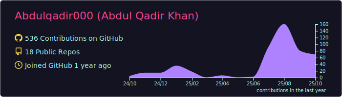
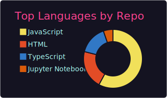
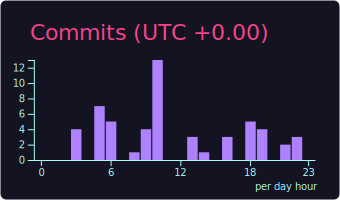

# Hi there! 👋 I'm Abdul Qadir Khan

  

---

## 🚀 About Me

- 🔭 **Currently working on:** Event-based Face Tagging & Recognition Platform
- 🌱 **Learning:** Advanced AWS Cloud Architecture & Serverless Technologies
- 💼 **Role:** Full Stack Developer at **Saylani Tech**
- 🌍 **Location:** Pakistan 🇵🇰
- 📫 **Contact:** aabdulqadir300@gmail.com
- ⚡ **Fun fact:** I merge frontend creativity with backend power to build scalable solutions!
- 🎯 **Focus:** Building AI-powered applications with modern tech stack

---

## 🛠️ Tech Stack & Tools

### Frontend Development

### Backend Development

### Databases

### Cloud & DevOps

---

## 📊 GitHub Analytics

<!-- 

  
  

 -->

  

## 📊 GitHub Summary Cards

---

## 🎯 Featured Projects

### 🤖 Face-Tagging Gallery Platform

**Advanced facial recognition system with AWS integration**

**Key Features:**
- 🎯 Real-time face detection & matching using AWS Rekognition
- 📸 Automated photo tagging and categorization system
- ⚡ Serverless architecture with Lambda functions
- 🔒 Secure image processing pipeline with S3 storage
- 📱 Responsive web interface with React
- 💾 DynamoDB for efficient metadata management

**Tech Stack:** React • Node.js • AWS Rekognition • Lambda • S3 • DynamoDB • MongoDB

---

### 📚 AI-Powered Learning Management System

**Comprehensive role-based LMS with intelligent features**

**Highlights:**
- 🧠 AI-driven personalized learning experience
- 👥 Multi-role system (Admin, Instructor, Student)
- 📊 Advanced analytics and progress tracking dashboard
- 📱 Mobile-responsive design with modern UI
- 🎯 Interactive quiz system with real-time feedback

**Tech Stack:** MERN Stack • JWT Auth • Cloudinary • AI Integration

---

## 📈 Contribution Graph

  

---

## 💼 Professional Experience

**Full Stack Developer @ Saylani Tech** *(2023 - Present)*
- 🚀 Leading development of scalable web applications
- ☁️ AWS cloud architecture implementation and optimization
- 📈 Built production-ready applications

---

## 💡 Fun Facts & Interests

- ⚡ **Code Style:** Clean code enthusiast with a passion for performance optimization
- 🐛 **Debugging:** I debug with console.log() and I'm proud of it! 😄
- ☕ **Fuel:** Powered by coffee and Stack Overflow solutions
- 🎯 **Motto:** "First make it work, then make it right, then make it fast!"
- 🎮 **Hobbies:** Photography 📸, Gaming 🎮, Tech Podcasts 🎧
- 🎵 **Coding Playlist:** Lofi Hip Hop, Synthwave, Epic Orchestral, or the silence of productive coding

---

## 📫 Let's Connect & Collaborate!

---

### 💭 Random Dev Quote

### 🎯 Visitor Count

---

**⭐ From [Abdul Qadir](https://github.com/Abdulqadir000)**

*"Building the future, one commit at a time! 🚀"*

---

  

